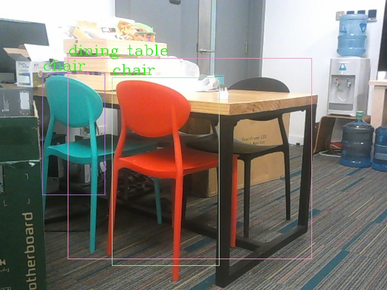

**System Environment**:

System: Ubuntu 18.04

Opencv: opencv 3.2

Tensorflow: 1.13.1

**Instructions**:

# The instruction for mobilenet-ssdv2 training
## Convert images to tf.record
1. Write label.pbtxt under the path models/research/object_detection/mobilenet_ssd_v2_train/dataset/
   The format like this:
``` 
    item {
   id: 1
   name: 'person'
}
 
    item {
   id: 2
   name: 'car'
}


``` 

2. Convert yout images and annotations to tfrecord by models datatool api.

   Commands:
``` 
    cd models/research/
    export PYTHONPATH=$PYTHONPATH:path to /models/research/:path to/models/research/slim
    protoc object_detection/protos/*.proto --python_out=.
    python object_detection/dataset_tools/create_coco_tf_record.py --image_dir=/path_to/img/ --ann_dir=/path_to/ann/ --output_path=/path_to/train.record --label_map_path=/path_to/demo/label.pbtxt
```

## Train tensorflow model(fine tuning)

1. Download the 'mobilenet ssd v2 quantized' model from model zoo, and replace it with models/research/object_detection/mobilenet_ssd_v2_train/pretrained_models(the origin one is the 'mobilenet ssd v2 quantized' as well)
2. Modify the data path in pipeline.config. The data is the tf record you generated. 
 ```
    train
    input_path:  "/path_to/train.record"

    test
    input_path:  "/path_to/train.record"
```
1. Training
``` 
    
    cd models/research/
    export PYTHONPATH=$PYTHONPATH: path to /models/research/:path to/models/research/slim
    protoc object_detection/protos/*.proto --python_out=.
    python object_detection/legacy/train.py --train_dir=path to /models/research/object_detection/mobilenet_ssd_v2_train/CP/ --pipeline_config_path=path to/models/research/object_detection/mobilenet_ssd_v2_train/pipeline.config

```


4. Using Tensorboard to visualize your training process
```
    tensorboard --logdir=/path_to/mobilenet_ssd_v2_train/CP
```
5. Export your model to frozen graph, which can cheeck the results with demo.py.
```
    python object_detection/export_inference_graph.py --input_type=image_tensor --pipeline_config_path=/path_to/pipleline.config --trained_checkpoint_prefix=/path_to/mobilenet_ssd_v2_train/CP/model.ckpt-xxxxxx --output_directory=/path_to/mobilenet_ssd_v2_train/IG/
```
6. Add label_map.json.
```
    {
        "1": "person"
    }
    {
        "2": "car"
    }
```   
7. Run demo.py.
```
    python demo.py PATH_TO_FROZEN_GRAPH cam_dir js_file
```
8. Convert frozen_graph to tf_lite
Use export_tflite_ssd_graph.py generate tflite_graph.pb  
```
    python object_detection/export_tflite_ssd_graph.py --input_type=image_tensor --pipeline_config_path=path to/models/research/object_detection/mobilenet_ssd_v2_train/IG/pipeline.config --trained_checkpoint_prefix=path to/models/research/object_detection/mobilenet_ssd_v2_train/IG/model.ckpt --output_directory=path to/models/research/object_detection/mobilenet_ssd_v2_train/tflite --add_postprocessing_op=true
```
9. Convert tflite_graph.pb to model.tflite
```
    tflite_convert --output_file=path to/models/research/object_detection/mobilenet_ssd_v2_train/tflite/model.tflite --graph_def_file=path to/models/research/object_detection/mobilenet_ssd_v2_train/tflite/tflite_graph.pb --input_arrays=normalized_input_image_tensor --output_arrays='TFLite_Detection_PostProcess','TFLite_Detection_PostProcess:1','TFLite_Detection_PostProcess:2','TFLite_Detection_PostProcess:3' --input_shape=1,300,300,3 --allow_custom_ops --output_format=TFLITE --inference_type=QUANTIZED_UINT8 --mean_values=128 --std_dev_values=127

```


## Apply tflite model with c++

1. Modify the line 89 at demo.cpp 
```
   tflite::FlatBufferModel::BuildFromFile("../model.tflite");
```
2. Modify the labelmap.txt with you annotation if you fine tuned your model.
3. Run demo.cpp on x86 unbuntu, make sure opencv and bazel are installed.
    1. Build libtensorflowlite.so, under the tensorflow directory.
    ```
                bazel build -c opt //tensorflow/lite:libtensorflowlite.so --fat_apk_cpu=arm64-v8a
    ```
    1. Move .so to **tensorflow_object_detection_tflite/lib**
    2. Change **find_library(TFLITE_LIBRARY tensorflow-lite "lib")** to **find_library(TFLITE_LIBRARY tensorflowlite "lib")** in **CMakeLists.txt**.
    3. Build cmake
    ```
            mkdir build
            cd build
            cmake ..
            make -j
            ./demo
    ```
4. Run demo.cpp on arm64-v8a ubuntu.
    1. Intall opencv on your arm64 motherboard.
    2. Build libtensorflow-lite.a, followed by the tensorflow tutorial https://www.tensorflow.org/lite/guide/build_arm64. Careful about the arm version, v7 or v8.
    3. Move .a to **tensorflow_object_detection_tflite/lib**
    4. keep find_library(TFLITE_LIBRARY tensorflow-lite "lib") unchanged.
    5. Build cmake
    ```
            mkdir build
            cd build
            cmake ..
            make -j
            ./demo
    ```
5. If there is a flatbuffers error, you should build flatbuffers on your desktop, and use its header files and .a lib file, put and replace them into tensorflow_object_detection_tflite/include and tensorflow_object_detection_tflite/lib, respectively. You can check here to know how to build. https://github.com/google/flatbuffers/issues/5569#issuecomment-543777629

5. Result image



